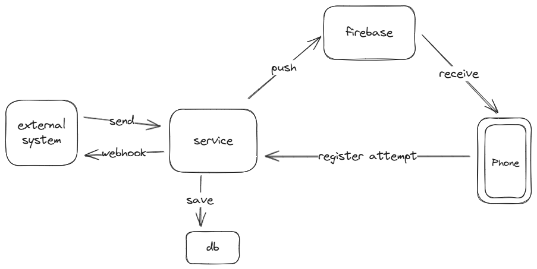

# Sms Gateway

sms-gateway allows you to send SMS messages to a mobile phone using a REST API. Based on Firebase push notification and Android no user interaction sms.

### Tech stack
- GoLang for service implementation
- MongoDB for storing the SMS message
- Firebase for sending push notification
- Android for receiving push notification and sending SMS message

## Big Picture
The following diagram shows the big picture of the system. The system is composed of the following components:
- **service**: The service is responsible for sending the SMS message to the mobile phone through push notification.
- **firebase**: The firebase is responsible for sending the push notification to the mobile phone.
- **mobile phone**: The mobile phone is responsible for receiving the push notification, sending the SMS message to the mobile phone and reporting the status of the SMS message to the service.
- **external-system**: The external system which requests the service to send the SMS message to the mobile phone and receives updates through webhooks.

